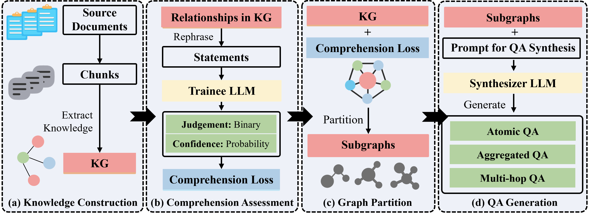

<p align="center">
  
</p>

<!-- icon -->

[](https://github.com/open-sciencelab/GraphGen)
[](https://github.com/open-sciencelab/GraphGen)
[](https://github.com/open-sciencelab/GraphGen/issues)
[](https://github.com/open-sciencelab/GraphGen/issues)
[](https://chenzihong.gitbook.io/graphgen-cookbook/)
[](https://pypi.org/project/graphg/)
[](https://cdn.vansin.top/internlm/dou.jpg)
[](https://arxiv.org/abs/2505.20416)
[](https://huggingface.co/papers/2505.20416)

[](https://huggingface.co/spaces/chenzihong/GraphGen)
[](https://modelscope.cn/studios/chenzihong/GraphGen)


GraphGen: Enhancing Supervised Fine-Tuning for LLMs with Knowledge-Driven Synthetic Data Generation

[English](README.md) | [中文](README_zh.md)

<details close>
<summary><b>📚 Table of Contents</b></summary>

- 📝 [What is GraphGen?](#-what-is-graphgen)
- 📌 [Latest Updates](#-latest-updates)
- ⚙️ [Support List](#-support-list)
- 🚀 [Quick Start](#-quick-start)
- 🏗️ [System Architecture](#-system-architecture)
- 🍀 [Acknowledgements](#-acknowledgements)
- 📚 [Citation](#-citation)
- 📜 [License](#-license)
- 📅 [Star History](#-star-history)

[//]: # (- 🌟 [Key Features]&#40;#-key-features&#41;)
[//]: # (- 💰 [Cost Analysis]&#40;#-cost-analysis&#41;)
[//]: # (- ⚙️ [Configurations]&#40;#-configurations&#41;)

</details>

## 📝 What is GraphGen?

GraphGen is a framework for synthetic data generation guided by knowledge graphs. Please check the [**paper**](https://arxiv.org/abs/2505.20416) and [best practice](https://github.com/open-sciencelab/GraphGen/issues/17).

Here is post-training result which **over 50% SFT data** comes from GraphGen and our data clean pipeline.

|  Domain   |                          Dataset                          |   Ours   | Qwen2.5-7B-Instruct (baseline) |
|:---------:|:---------------------------------------------------------:|:--------:|:------------------------------:|
|   Plant   | [SeedBench](https://github.com/open-sciencelab/SeedBench) | **65.9** |              51.5              |
|  Common   |                           CMMLU                           |   73.6   |            **75.8**            |
| Knowledge |                       GPQA-Diamond                        | **40.0** |              33.3              |
|   Math    |                          AIME24                           | **20.6** |              16.7              |
|           |                          AIME25                           | **22.7** |              7.2               |

It begins by constructing a fine-grained knowledge graph from the source text，then identifies knowledge gaps in LLMs using the expected calibration error metric, prioritizing the generation of QA pairs that target high-value, long-tail knowledge.
Furthermore, GraphGen incorporates multi-hop neighborhood sampling to capture complex relational information and employs style-controlled generation to diversify the resulting QA data.

After data generation, you can use [LLaMA-Factory](https://github.com/hiyouga/LLaMA-Factory) and [xtuner](https://github.com/InternLM/xtuner) to finetune your LLMs.

## 📌 Latest Updates
- **2026.01.15**: **LLM benchmark synthesis** now supports single/multiple-choice & fill-in-the-blank—ideal for education 🌟🌟
- **2025.12.26**: Knowledge graph evaluation metrics about accuracy (entity/relation), consistency (conflict detection), structural robustness (noise, connectivity, degree distribution)
- **2025.12.16**: Added [rocksdb](https://github.com/facebook/rocksdb) for key-value storage backend and [kuzudb](https://github.com/kuzudb/kuzu) for graph database backend support.

<details>
<summary>History</summary>

- **2025.12.16**: Added [vllm](https://github.com/vllm-project/vllm) for local inference backend support.
- **2025.12.16**: Refactored the data generation pipeline using [ray](https://github.com/ray-project/ray) to improve the efficiency of distributed execution and resource management.
- **2025.12.1**: Added search support for [NCBI](https://www.ncbi.nlm.nih.gov/) and [RNAcentral](https://rnacentral.org/) databases, enabling extraction of DNA and RNA data from these bioinformatics databases.
- **2025.10.30**: We support several new LLM clients and inference backends including [Ollama_client](https://github.com/open-sciencelab/GraphGen/blob/main/graphgen/models/llm/api/ollama_client.py), [http_client](https://github.com/open-sciencelab/GraphGen/blob/main/graphgen/models/llm/api/http_client.py), [HuggingFace Transformers](https://github.com/open-sciencelab/GraphGen/blob/main/graphgen/models/llm/local/hf_wrapper.py) and [SGLang](https://github.com/open-sciencelab/GraphGen/blob/main/graphgen/models/llm/local/sglang_wrapper.py).
- **2025.10.23**: We support VQA(Visual Question Answering) data generation now. Run script: `bash scripts/generate/generate_vqa.sh`.
- **2025.10.21**: We support PDF as input format for data generation now via [MinerU](https://github.com/opendatalab/MinerU).
- **2025.09.29**: We auto-update gradio demo on [Hugging Face](https://huggingface.co/spaces/chenzihong/GraphGen) and [ModelScope](https://modelscope.cn/studios/chenzihong/GraphGen).
- **2025.08.14**: We have added support for community detection in knowledge graphs using the Leiden algorithm, enabling the synthesis of Chain-of-Thought (CoT) data.
- **2025.07.31**: We have added Google, Bing, Wikipedia, and UniProt as search back-ends.
- **2025.04.21**: We have released the initial version of GraphGen.

</details>


## ⚙️ Support List

We support various LLM inference servers, API servers, inference clients, input file formats, data modalities, output data formats, and output data types.
Users can flexibly configure according to the needs of synthetic data.


| Inference Server                                                         | Api Server                                                                     | Inference Client                                           | Data Source                                                                                                                                                                                                                                                                           | Data Modal    | Data Type                                       |
|--------------------------------------------------------------------------|--------------------------------------------------------------------------------|------------------------------------------------------------|---------------------------------------------------------------------------------------------------------------------------------------------------------------------------------------------------------------------------------------------------------------------------------------|---------------|-------------------------------------------------|
| [![hf-icon]HF][hf]<br>[![sg-icon]SGLang][sg]<br>[![vllm-icon]vllm][vllm] | [![sif-icon]Silicon][sif]<br>[![oai-icon]OpenAI][oai]<br>[![az-icon]Azure][az] | HTTP<br>[![ol-icon]Ollama][ol]<br>[![oai-icon]OpenAI][oai] | Files(CSV, JSON, PDF, TXT, etc.)<br>Databases([![uniprot-icon]UniProt][uniprot], [![ncbi-icon]NCBI][ncbi], [![rnacentral-icon]RNAcentral][rnacentral])<br>Search Engines([![bing-icon]Bing][bing], [![google-icon]Google][google])<br>Knowledge Graphs([![wiki-icon]Wikipedia][wiki]) | TEXT<br>IMAGE | Aggregated<br>Atomic<br>CoT<br>Multi-hop<br>VQA |

<!-- links -->
[hf]: https://huggingface.co/docs/transformers/index
[sg]: https://docs.sglang.ai
[vllm]: https://github.com/vllm-project/vllm
[sif]: https://siliconflow.cn
[oai]: https://openai.com
[az]: https://azure.microsoft.com/en-us/services/cognitive-services/openai-service/
[ol]: https://ollama.com
[uniprot]: https://www.uniprot.org/
[ncbi]: https://www.ncbi.nlm.nih.gov/
[rnacentral]: https://rnacentral.org/
[wiki]: https://www.wikipedia.org/
[bing]: https://www.bing.com/
[google]: https://www.google.com


<!-- icons -->
[hf-icon]: https://www.google.com/s2/favicons?domain=https://huggingface.co
[sg-icon]: https://www.google.com/s2/favicons?domain=https://docs.sglang.ai
[vllm-icon]: https://www.google.com/s2/favicons?domain=https://docs.vllm.ai
[sif-icon]: https://www.google.com/s2/favicons?domain=siliconflow.com
[oai-icon]: https://www.google.com/s2/favicons?domain=https://openai.com
[az-icon]: https://www.google.com/s2/favicons?domain=https://azure.microsoft.com
[ol-icon]: https://www.google.com/s2/favicons?domain=https://ollama.com

[uniprot-icon]: https://www.google.com/s2/favicons?domain=https://www.uniprot.org
[ncbi-icon]: https://www.google.com/s2/favicons?domain=https://www.ncbi.nlm.nih.gov/
[rnacentral-icon]: https://www.google.com/s2/favicons?domain=https://rnacentral.org/
[wiki-icon]: https://www.google.com/s2/favicons?domain=https://www.wikipedia.org/
[bing-icon]: https://www.google.com/s2/favicons?domain=https://www.bing.com/
[google-icon]: https://www.google.com/s2/favicons?domain=https://www.google.com


## 🚀 Quick Start

Experience GraphGen Demo through [Huggingface](https://huggingface.co/spaces/chenzihong/GraphGen) or [Modelscope](https://modelscope.cn/studios/chenzihong/GraphGen).

For any questions, please check [FAQ](https://github.com/open-sciencelab/GraphGen/issues/10), open new [issue](https://github.com/open-sciencelab/GraphGen/issues) or join our [wechat group](https://cdn.vansin.top/internlm/dou.jpg) and ask.

### Preparation

1. Install [uv](https://docs.astral.sh/uv/reference/installer/)

    ```bash
    # You could try pipx or pip to install uv when meet network issues, refer the uv doc for more details
    curl -LsSf https://astral.sh/uv/install.sh | sh
    ```
2. Clone the repository

    ```bash
    git clone --depth=1 https://github.com/open-sciencelab/GraphGen
    cd GraphGen
    ```

3. Create a new uv environment

    ```bash
     uv venv --python 3.10
    ```
   
4. Configure the dependencies

    ```bash
    uv pip install -r requirements.txt
    ```

### Run Gradio Demo

   ```bash
   python -m webui.app
   ```


### Run from PyPI

1. Install GraphGen
   ```bash
   uv pip install graphg
   ```

2. Run in CLI
   ```bash
   SYNTHESIZER_MODEL=your_synthesizer_model_name \
   SYNTHESIZER_BASE_URL=your_base_url_for_synthesizer_model \
   SYNTHESIZER_API_KEY=your_api_key_for_synthesizer_model \
   TRAINEE_MODEL=your_trainee_model_name \
   TRAINEE_BASE_URL=your_base_url_for_trainee_model \
   TRAINEE_API_KEY=your_api_key_for_trainee_model \
   graphg --output_dir cache
   ```

### Run from Source

1. Configure the environment
   - Create an `.env` file in the root directory
     ```bash
     cp .env.example .env
     ```
   - Set the following environment variables:
     ```bash
      # Tokenizer
      TOKENIZER_MODEL=
      
      # LLM
      # Support different backends: http_api, openai_api, ollama_api, ollama, huggingface, tgi, sglang, tensorrt
      # Synthesizer is the model used to construct KG and generate data
      # Trainee is the model used to train with the generated data

      # http_api / openai_api
      SYNTHESIZER_BACKEND=openai_api
      SYNTHESIZER_MODEL=gpt-4o-mini
      SYNTHESIZER_BASE_URL=
      SYNTHESIZER_API_KEY=
      TRAINEE_BACKEND=openai_api
      TRAINEE_MODEL=gpt-4o-mini
      TRAINEE_BASE_URL=
      TRAINEE_API_KEY=
      
      # azure_openai_api
      # SYNTHESIZER_BACKEND=azure_openai_api
      # The following is the same as your "Deployment name" in Azure
      # SYNTHESIZER_MODEL=<your-deployment-name>
      # SYNTHESIZER_BASE_URL=https://<your-resource-name>.openai.azure.com/openai/deployments/<your-deployment-name>/chat/completions
      # SYNTHESIZER_API_KEY=
      # SYNTHESIZER_API_VERSION=<api-version>
      
      # # ollama_api
      # SYNTHESIZER_BACKEND=ollama_api
      # SYNTHESIZER_MODEL=gemma3
      # SYNTHESIZER_BASE_URL=http://localhost:11434
      #
      # Note: TRAINEE with ollama_api backend is not supported yet as ollama_api does not support logprobs.
      
      # # huggingface
      # SYNTHESIZER_BACKEND=huggingface
      # SYNTHESIZER_MODEL=Qwen/Qwen2.5-0.5B-Instruct
      #
      # TRAINEE_BACKEND=huggingface
      # TRAINEE_MODEL=Qwen/Qwen2.5-0.5B-Instruct
      
      # # sglang
      # SYNTHESIZER_BACKEND=sglang
      # SYNTHESIZER_MODEL=Qwen/Qwen2.5-0.5B-Instruct
      # SYNTHESIZER_TP_SIZE=1
      # SYNTHESIZER_NUM_GPUS=1
      
      # TRAINEE_BACKEND=sglang
      # TRAINEE_MODEL=Qwen/Qwen2.5-0.5B-Instruct
      # SYNTHESIZER_TP_SIZE=1
      # SYNTHESIZER_NUM_GPUS=1
      
      # # vllm
      # SYNTHESIZER_BACKEND=vllm
      # SYNTHESIZER_MODEL=Qwen/Qwen2.5-0.5B-Instruct
      # SYNTHESIZER_NUM_GPUS=1
      
      # TRAINEE_BACKEND=vllm
      # TRAINEE_MODEL=Qwen/Qwen2.5-0.5B-Instruct
      # TRAINEE_NUM_GPUS=1
     ```
2. (Optional) Customize generation parameters in `config.yaml` .

   Edit the corresponding YAML file, e.g.:

    ```yaml
      # examples/generate/generate_aggregated_qa/aggregated_config.yaml
      global_params:
        working_dir: cache
        graph_backend: kuzu # graph database backend, support: kuzu, networkx
        kv_backend: rocksdb # key-value store backend, support: rocksdb, json_kv
   
      nodes:
        - id: read_files # id is unique in the pipeline, and can be referenced by other steps
          op_name: read
          type: source
          dependencies: []
          params:
            input_path:
              - examples/input_examples/jsonl_demo.jsonl # input file path, support json, jsonl, txt, pdf. See examples/input_examples for examples

      # additional settings...
    ```

3. Generate data

   Pick the desired format and run the matching script:
      
   | Format          | Script to run                                                                | Notes                                                                      |
   |-----------------|------------------------------------------------------------------------------|----------------------------------------------------------------------------|
   | `cot`           | `bash examples/generate/generate_cot_qa/generate_cot.sh`                     | Chain-of-Thought Q\&A pairs                                                |
   | `atomic`        | `bash examples/generate/generate_atomic_qa/generate_atomic.sh`               | Atomic Q\&A pairs covering basic knowledge                                 |
   | `aggregated`    | `bash examples/generate/generate_aggregated_qa/generate_aggregated.sh`       | Aggregated Q\&A pairs incorporating complex, integrated knowledge          |
   | `multi-hop`     | `examples/generate/generate_multi_hop_qa/generate_multi_hop.sh`              | Multi-hop reasoning Q\&A pairs                                             |
   | `vqa`           | `bash examples/generate/generate_vqa/generate_vqa.sh`                        | Visual Question Answering pairs combining visual and textual understanding |
   | `multi_choice`  | `bash examples/generate/generate_multi_choice_qa/generate_multi_choice.sh`   | Multiple-choice question-answer pairs                                      |
   | `multi_answer`  | `bash examples/generate/generate_multi_answer_qa/generate_multi_answer.sh`   | Multiple-answer question-answer pairs                                      |
   | `fill_in_blank` | `bash examples/generate/generate_fill_in_blank_qa/generate_fill_in_blank.sh` | Fill-in-the-blank question-answer pairs                                    |
   

4. Get the generated data
   ```bash
   ls cache/output
   ```

### Run with Docker
1. Build the Docker image
   ```bash
   docker build -t graphgen .
   ```
2. Run the Docker container
   ```bash
    docker run -p 7860:7860 graphgen
    ```


## 🏗️ System Architecture

See [analysis](https://deepwiki.com/open-sciencelab/GraphGen) by deepwiki for a technical overview of the GraphGen system, its architecture, and core functionalities. 


### Workflow



## 🍀 Acknowledgements
- [SiliconFlow](https://siliconflow.cn) Abundant LLM API, some models are free
- [LightRAG](https://github.com/HKUDS/LightRAG) Simple and efficient graph retrieval solution
- [ROGRAG](https://github.com/tpoisonooo/ROGRAG) A robustly optimized GraphRAG framework
- [DB-GPT](https://github.com/eosphoros-ai/DB-GPT) An AI native data app development framework


## 📚 Citation
If you find this repository useful, please consider citing our work:
```bibtex
@misc{chen2025graphgenenhancingsupervisedfinetuning,
      title={GraphGen: Enhancing Supervised Fine-Tuning for LLMs with Knowledge-Driven Synthetic Data Generation}, 
      author={Zihong Chen and Wanli Jiang and Jinzhe Li and Zhonghang Yuan and Huanjun Kong and Wanli Ouyang and Nanqing Dong},
      year={2025},
      eprint={2505.20416},
      archivePrefix={arXiv},
      primaryClass={cs.CL},
      url={https://arxiv.org/abs/2505.20416}, 
}
```

## 📜 License
This project is licensed under the [Apache License 2.0](LICENSE).

## 📅 Star History

[](https://www.star-history.com/#InternScience/GraphGen&Date)
